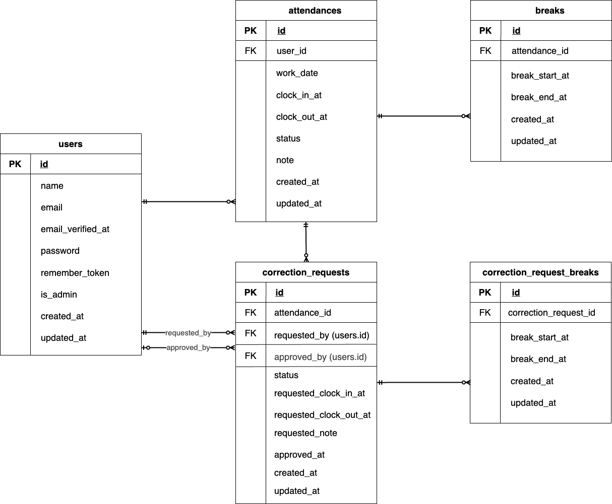

# COACHTECH 模擬案件② 勤怠管理アプリ

## アプリケーション概要

本アプリケーションは、企業向けの **勤怠管理アプリ** です。
一般ユーザーは出勤・休憩・退勤の打刻や勤怠確認、修正申請を行うことができ、
管理者ユーザーは全ユーザーの勤怠確認および修正申請の承認を行うことができます。

---

## 環境構築

本アプリケーションは Docker を使用して Laravel / MySQL 環境を構築します。
以下の手順に沿ってセットアップしてください。

### Docker ビルド

- git clone
- cd coachtech-attendance
- cp src/.env.example src/.env
- docker compose up -d --build

### Laravel 環境構築

- docker compose exec php bash
- composer install
- php artisan key:generate
- php artisan migrate --seed

## 初期データについて

### ログイン情報

#### 一般ユーザー

- メールアドレス：user@example.com
- パスワード：password

#### 管理者ユーザー

- メールアドレス：admin@example.com
- パスワード：password

※ 上記ユーザーはシーディングによって作成されます。

## 開発環境（URL）

- ***

## 使用技術（実行環境）

- PHP：8.1（php:8.1-fpm）
- Laravel：8.75
- MySQL：8.0.26（platform: linux/amd64）
- Nginx：1.21.1
- Docker：Docker Desktop
- 認証：Laravel Fortify
- バリデーション：FormRequest

---

## テスト

- docker compose exec php bash
- php artisan test

---

## ER 図

